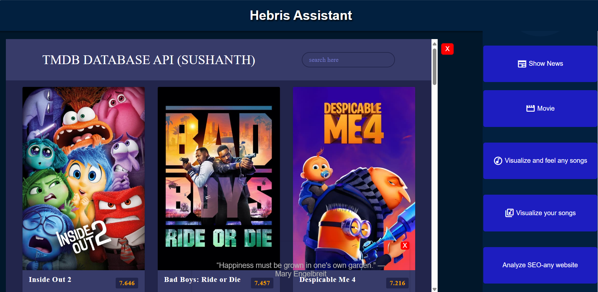

# Hebri's Assistant - Accumulated Tools

Welcome to Hebri's Assistant, a collection of tools designed to assist you in various tasks ranging from checking the weather to analyzing SEO metrics. This project aims to provide a convenient way to access different functionalities through APIs and custom visualizations.

## Features

### 1. Weather API

Retrieve current weather information using a weather API. Stay informed about the latest weather conditions effortlessly.

### 2. News API

Get updated with the latest news from around the world using a news API. Stay connected with what's happening globally.

### 3. Songs viz

Access a library of songs and retrieve information such as song details, lyrics, and more. Enjoy your favorite tunes seamlessly.

### 4. Song Visualization

Visualize songs in a unique way, exploring their structure, sentiment, or any other interesting metrics through custom visualizations.

### 5. SEO Analyzer

Analyze SEO metrics for a given website or web page. Gain insights into SEO performance and opportunities for improvement.

### 6. Custom Song Visualization

Create custom visualizations for songs based on user preferences or specific metrics. Explore music in a visually engaging manner.

## Getting Started

To get started with Hebri's Assistant, try now 

